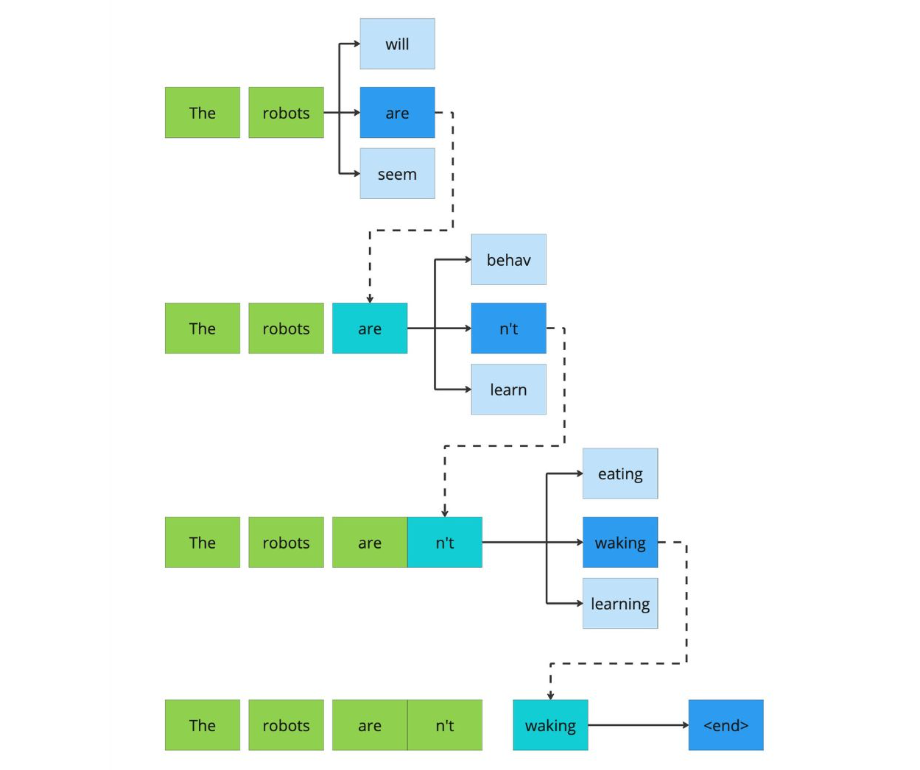
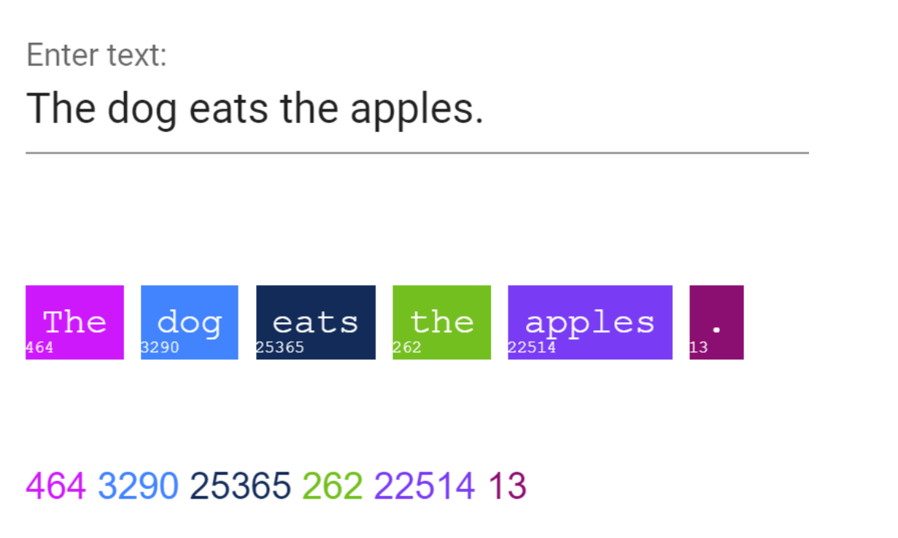

# AI Engineering and LLM Fundamentals

## Difference between AI Engineer vs AI Researcher vs ML Engineer vs Data Scientist


* **AI Engineer**: Focuses on integrating pre-built AI models (like GPT or CV systems) into real-world applications. They prioritize user-facing features and AI capabilities over algorithmic innovation or infrastructure scaling.
* **AI Researcher**: Advances core AI theory and algorithms, often in academic or R&D environments. Their focus is on developing new models and publishing breakthroughs—not deployment or application.
* **ML Engineer**: Turns ML models into scalable, production-ready systems. They build pipelines, optimize performance, and handle deployment (MLOps). Emphasis is on robust engineering, not model discovery.
* **Data Scientist**: Analyzes data to extract insights and prototype models. They focus on business impact through data exploration, prediction, and experimentation—not system scaling or engineering.

These roles overlap, but roughly: **AI Researchers** innovate on model algorithms; **Data Scientists** explore data and build prototypes; **ML Engineers** productionize models; **AI Engineers** integrate AI into products.

## Large Language Models (LLMs)

A **language model** is a machine learning model trained to predict the next word or token in a sequence, effectively learning what text is likely or plausible. A **large language model (LLM)** does this at scale—using massive neural networks (typically **transformer-based**) trained on vast text datasets.

Modern LLMs like GPT-3/4 use **self-attention** to understand long-range context, enabling them to generate coherent paragraphs instead of just single words. As model size (number of **parameters**) and training data grow, so do their capabilities—handling tasks like translation, summarization, Q&A, and code generation.

LLMs learn **token embeddings** and use billions of learned **parameters** (weights) to map input text to output. "Large" refers to the model's scale—GPT-4 has vastly more parameters than earlier models like BERT. Transformers process entire sequences by attending to all tokens at once, unlike older RNNs, allowing for much deeper and broader text understanding.

## Tokens in LLMs





A token is the smallest unit of text an LLM understands—typically a word, subword, or symbol. For instance, "darkness" might be split into two tokens: "dark" and "ness". Before processing, text is tokenized into these units, each mapped to a numeric ID and embedding.

LLMs operate entirely in token space—predicting the next token based on prior ones. A model's vocabulary often contains tens of thousands of tokens. When using the API, your input text is converted into tokens, processed, and then decoded back into text.

Tokens are central to LLM usage:

- Context limits, max_tokens, and costs are measured in tokens.
- Longer or complex words may consume multiple tokens.
- Compact wording helps reduce token count and cost.
- Understanding tokens is essential for efficient and predictable LLM interactions.

Text to Token: `https://gptforwork.com/tools/tokenizer`

## Overview of OpenAI's GPT Models

OpenAI has released several GPT models, each improving in scale, speed, or capability:

**GPT-3.5 (late 2022)**: A refined GPT-3 version used in ChatGPT's free tier and the gpt-3.5-turbo API. It handles fluent text tasks (writing, Q&A, translation) with ~16k token context. Faster and cheaper than previous GPT-3 variants.

**GPT-4 (Mar 2023)**: Improved reasoning and language understanding, with multi-modal support (text + image). Comes in versions like gpt-4 (~8k tokens) and gpt-4-32k. Stronger performance than GPT-3.5.

**GPT-4 Turbo (Nov 2023)**: A cheaper, faster GPT-4 variant with a massive 128k token context (~300 pages). Powers ChatGPT by default and appears in the API (e.g. gpt-4-1106-preview or gpt-4o-32k on Azure).

**GPT-4o (May 2024)**: The latest "Omni" model with unified text, image, and audio input. Matches or exceeds GPT-4 Turbo in performance, especially for vision and multilingual tasks.

Turbo models offer incremental upgrades: higher context, faster response, and lower cost.

GPT-3.5 is best for lightweight, cost-effective tasks; GPT-4/4o is preferred for complex or high-accuracy use cases.

OpenAI Documentation: `https://platform.openai.com/docs/models`

## Context Windows and Knowledge Cutoffs

A model's context window is the max number of tokens it can process at once (input + output). For example:

- GPT-3.5-turbo: ~16,000 tokens
- GPT-4: 8,000 tokens
- GPT-4-32k: 32,000 tokens
- GPT-4 Turbo: 128,000 tokens

Exceeding this limit causes earlier tokens to be dropped. Larger windows improve coherence in long conversations or documents. Context size is fixed per model—check limits before use.

The knowledge cutoff is the latest point in time the model was trained on. It can't access facts beyond this unless provided in the prompt. Example cutoffs:

- GPT-3.5: ~early 2022
- GPT-4: ~early 2023
- GPT-4 Turbo (Nov 2023): Dec 2023
- GPT-4 Turbo (April 2024 update): April 2024

Always check the cutoff date if fresh information is important.

## Calling the OpenAI API

To use OpenAI's LLMs in code, you call their Chat Completion API (for chat-based models) or the older Completion API (for non-chat models). In Python, you can use the openai library. For example:

```python
import openai

openai.api_key = "YOUR_API_KEY_HERE"
response = openai.ChatCompletion.create(
    model="gpt-3.5-turbo",
    messages=[
        {"role": "system", "content": "You are a helpful assistant."},
        {"role": "user",   "content": "Explain quantum entanglement."}
    ],
    temperature=0.7,
    max_tokens=150
)
answer = response["choices"][0]["message"]["content"]
print(answer)
```

```javascript
import OpenAI from "openai";

const openai = new OpenAI({
  apiKey: "YOUR_API_KEY_HERE" // Replace with your actual API key
});

async function getChatResponse() {
  try {
    const response = await openai.chat.completions.create({
      model: "gpt-3.5-turbo",
      messages: [
        { role: "system", content: "You are a helpful assistant." },
        { role: "user", content: "Explain quantum entanglement." }
      ],
      temperature: 0.7,
      max_tokens: 150
    });

    const answer = response.choices[0].message.content;
    console.log(answer);
  } catch (error) {
    console.error("Error:", error);
  }
}

getChatResponse();
```

This code sets your API key, specifies the model (e.g. "gpt-3.5-turbo"), and sends a list of messages (discussed below). It also sets parameters like temperature and max_tokens. The API returns a JSON object; you extract the reply from response["choices"][0]["message"]["content"].

You can also call via curl or other HTTP client. A curl example:

```bash
curl https://api.openai.com/v1/chat/completions \
  -H "Authorization: Bearer $OPENAI_API_KEY" \
  -H "Content-Type: application/json" \
  -d '{"model": "gpt-4", "messages":[{"role":"user","content":"Hello"}]}'
```

This returns similar JSON. OpenAI's documentation provides details. The key idea: set model, pass messages as an array of {role, content} objects, and optionally tune other parameters (see below). The messages roles include "system", "user", and "assistant" (explained below). Each API call is stateless unless you maintain context manually, so you must send the whole conversation history in each request to preserve memory.

## API Output Structure

The API response is a JSON object. Important fields include:

**choices**: a list of completion choices. For chat, each choice has a message (with role and content). Typically you use choices[0]. For example, one choice might be {"message":{"role":"assistant","content":"Sure, here's an explanation..."}, "finish_reason":"stop", ...}.

**message**: within each choice, message.content is the generated text. (The role is "assistant" for model replies.) See the example response below.

**finish_reason**: why generation stopped (e.g. "stop" if done, or "length" if truncated by max_tokens).

**usage**: token counts (prompt_tokens, completion_tokens, total_tokens) for billing and analysis.

Example (abridged) response for a question "Who founded Microsoft?":

```json
{
  "choices": [
    {
      "message": {
        "role": "assistant",
        "content": "Microsoft was founded by Bill Gates and Paul Allen..."
      },
      "finish_reason": "stop",
      "index": 0
    }
  ],
  "usage": {
    "prompt_tokens": 29,
    "completion_tokens": 73,
    "total_tokens": 102
  },
  "model": "gpt-4",
  "id": "chatcmpl-..."
}
```

This shows the assistant's reply under choices[0].message.content and that 73 tokens were generated. All API calls follow this structure.

## Roles: system, user, assistant

In the Chat API, every message has a role field:

**system**: Setup or instructions for the assistant. Used to prime the model with behavior or context. For example, "You are a helpful tutor." or multi-line instructions. This message is usually first in the list.

**user**: The user's message or query. These simulate what an end-user asks the chatbot. There can be multiple user messages.

**assistant**: An assistant's previous reply (usually from the last turn). When doing multi-turn chat, you include the assistant's prior messages as well to provide context (the model sees the whole message list).

Thus, you format the conversation as [ {"role":"system", ...}, {"role":"user", ...}, {"role":"assistant", ...}, {"role":"user", ...} ]. The OpenAI model is trained to continue the conversation given this format. For example:

```json
[
  {"role": "system", "content": "You are a helpful assistant."},
  {"role": "user",   "content": "Translate 'hello' to French."}
]
```

When sent, the model will generate an assistant message with the translation. Roles ensure the model knows which parts of the prompt are instructions vs queries.

## No Built-In Memory

LLMs are stateless by default. Each API call is independent and the model has no persistent memory beyond what you send in the prompt. In practice, this means the model does not "remember" past interactions unless you include them in the conversation history. As Pinecone notes, "LLMs are stateless – meaning each incoming query is processed independently of other interactions. The only thing that exists… is the current input".

To simulate memory or maintain context, you must send the entire conversation (previous user and assistant messages) on each request. Alternatively, one can store and retrieve information in external memory systems (databases, embeddings, fine-tuned memories). But by default, LLMs have no internal state or long-term memory after a request finishes.

## Prompting Strategies

**Role Prompting**: Assign the model a persona (e.g., "You are a helpful math teacher") to guide tone, style, and content. This improves relevance and creativity by aligning responses with the assumed role.

**Few-Shot Prompting**: Include 2–5 input-output examples to show the model the desired format or behavior. Useful when fine-tuning isn't an option—helps seed the correct response style.

**Chain-of-Thought (CoT) Prompting**: Ask the model to reason step by step (e.g., "Let's think through this"). This boosts accuracy on complex tasks by encouraging intermediate reasoning.

**Structured Prompting**: Use clear instructions and formats (e.g., bullet points, numbered steps, JSON). Helps break down tasks and ensures the model follows a defined output structure.

These methods can be combined. For example, role prompt as an "expert translator," give few-shot examples, and request step-by-step reasoning for best results.

## Parameter Tuning

When calling the API, several parameters control the generation:

**max_tokens**: The maximum number of tokens to generate in the completion. This sets an upper bound on the response length. For example, setting max_tokens=50 means the model will stop after about 50 tokens (or earlier if it hits a stop sequence). Adjusting this prevents overly short or excessively long outputs.

**temperature**: Controls randomness/creativity. A higher temperature (e.g. 0.8–1.0) makes the output more random and creative; a lower temperature (e.g. 0.0–0.3) makes it more deterministic and focused on high-probability tokens. At temperature=1, the model uses its raw probabilities. Values >1 flatten probabilities (more creativity), values <1 make the model "play it safe". Use low temperature for factual or coding tasks, and higher temperature for brainstorming or creative writing.

**top_p (nucleus sampling)**: Often used with temperature, though typically you tune one or the other. It limits token selection to a subset whose cumulative probability is p (e.g. 0.9).

**stop**: One or more sequences where generation will stop. You can supply a string or array of strings. When the model's output includes any stop sequence, it halts there. For instance, you might set stop=["\n\n"] to end after a blank line, or stop=["END"] if you want the model to stop when it writes "END". This is useful for structured outputs or to prevent run-on answers.

**frequency_penalty**: Penalizes tokens that are already frequent in the generated text. It reduces repetition by lowering the probability of tokens that have appeared many times. Higher values (up to 2.0) make the output use more diverse words, while negative values encourage repetition. For example, a high frequency_penalty can prevent the model from repeating the same phrase.

**presence_penalty**: Penalizes any token that has already appeared, regardless of count. It simply discourages reuse of words already in the text. Use it to encourage introduction of new topics or terms in the output. Positive values (up to 2.0) make the model avoid previously seen tokens; negative values encourage it to reuse them. Unlike frequency penalty, presence penalty does not scale with count—it's a fixed penalty for any prior token.

By tuning these parameters, you can shape the model's behavior. For example, creative writing might use temperature=1.2 and top_p=0.95, while a strict Q&A might use temperature=0.0 and higher penalties to avoid randomness and repetition.