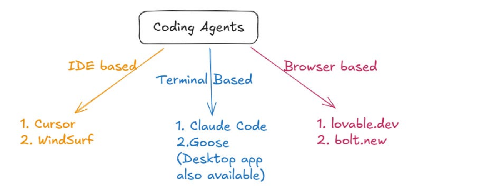

# Notes

## AI Assistants vs Agents


AI assistants and AI agents represent two ends of the autonomous spectrum. An AI assistant (like Siri, Alexa, or ChatGPT) works at your request: it answers questions or performs tasks you explicitly ask. An AI agent is more autonomous and goal-driven: it can plan, act, and use tools toward achieving a goal without being told each step. "AI assistants are reactive, performing tasks at your request. AI agents are proactive, working autonomously to achieve a specific goal by any means at their disposal". In practice, assistants handle single-step tasks (e.g. "write a function to sort this list"), whereas agents handle multi-step goals (e.g. "build a REST API that manages user accounts, including database setup and authentication").

**Use cases (Assistants):** Chatbots, virtual assistants, code autocompletion (Copilot, ChatGPT prompts), customer support.

**Use cases (Agents):** Autonomous project management, automated debugging, devops bots, "agentic" coding tools that generate and integrate code changes across a codebase. Agents can test and iterate on solutions (e.g. AutoGPT-style loops), whereas assistants typically require human in the loop at each step.

## What Are Coding Agents

Coding agents are AI tools designed to assist with software development by using large language models (LLMs) and other tools to automate coding tasks. They can generate, debug, and optimize code, acting like smart developer assistants.

**Capabilities:** They write code from descriptions, refactor codebases, generate tests, explain code, and integrate with APIs or databases. For example, a coding agent can take a task like "Add email validation" and update both the form logic and tests automatically.

**Applications:** Common uses include rapid prototyping, boilerplate generation, code review automation, and debugging. They're integrated into IDEs (e.g., GitHub Copilot), no-code tools, and CI pipelines to speed up development and reduce repetitive work.

## Internal Working of a Coding Agent

At their core, coding agents combine a powerful LLM (like GPT-4 or Claude) with orchestration and tool layers. The LLM generates code; the agent framework handles planning, context retrieval, tool use, and feedback.




### Key Components:

- **LLM Core:** Generates code using user instructions plus relevant project context. Large context windows (~20k tokens) allow processing of entire files.
- **Context/Memory:** Uses techniques like RAG (semantic search, embeddings) to retrieve relevant code, docs, or prior chats. Maintains both short-term (open files) and long-term memory (project knowledge) to reduce hallucinations.
- **Tool Integration:** Executes code, runs commands, queries APIs/DBs. Protocols like MCP let agents interact with real dev tools (e.g., GitHub, Stripe).
- **Plan-Act Loop:** Plans steps using chain-of-thought reasoning, executes code, observes results, and iterates based on feedback (e.g., test failures).
- **Learning:** Some agents use RLHF or reinforcement-based fine-tuning (RFT) to improve with usage. Feedback like passing tests can guide future actions.

In short, a coding agent flows like:
**User Prompt → Context → Code Generation → Execution → Feedback → Refine.**

It acts as a semi-autonomous co-developer, blending LLM knowledge, project-specific memory, and tool use to deliver working code.

## Comparative Overview of Leading Coding Agents

| Feature | Cursor | Windsurf | v0.dev (Vercel) | Bolt (StackBlitz) | Lovable | Replit | Cline (VSCode) | Devin (Cognition) |
|---------|--------|----------|-----------------|-------------------|---------|--------|----------------|-------------------|
| Platform/IDE | Standalone AI IDE (VSCode-like) + VSCode/JetBrains extensions | VSCode fork with AI ("Cascade" feature) | Web-based chat UI integrated with Vercel (Next.js) | In-browser web IDE | Web no-code IDE | Cloud IDE (Replit) | VSCode extension (open-source) | Web/SaaS platform (dashboard/API) |
| Integration | Deep codebase indexing, context rules, GPT/Claude APIs | Auto-context-filling, runs shell cmds by default | UI component blocks (React/Vue/Svelte) generation; CLI scaffold integration | Chat agent in StackBlitz with Figma, Supabase, Netlify, Stripe, Expo plugins | Chat agent for app-building; Figma import, Supabase/Stripe integration | Chat agent (Ghostwriter) and "Replit Agent" tool | Reads/writes files, executes terminal/browser via Model Context Protocol | Integrated "AI engineer" with shell/browser/editor in sandbox |
| Autonomy Level | User-initiated code completions & multi-file tasks; Agent mode for end-to-end features | Agentic (Cascade can autonomously modify files, run commands); easier UX for beginners | Guided AI (block generation on demand); not fully autonomous | Chat-driven full-stack app generation; some high-level planning | High-level app builder (no-code); requires human prompts but hides coding details | Can create apps from spec; user supervises via chat; also code-completion (Copilot-like) | Fully agentic: plan-&-act loops, semi-autonomous (user oversees and approves) | Fully autonomous AI developer, sets its own plan and uses multi-agent dispatch |
| Languages/Tech | Multi-language (Python, JS/TS, Java, Swift, etc.); strong web focus | Multi-language (same base as Cursor) | JavaScript/TypeScript (React, Vue, Svelte, HTML/CSS) | JavaScript/TypeScript (full-stack: React, Node, Mobile) | JavaScript/TypeScript (web apps, no-code) | Broad: Python, JS, C, etc (any supported by Replit) | Language-agnostic (supports any language VSCode does) | Broad (Python, JS, etc; aims for general software dev) |
| LLM Models Used | By default Claude-3.x; supports OpenAI (GPT-4), others via API keys | Likely Claude/OpenAI (proprietary) | Proprietary (v0 1.5 model, GPT-4 in beta) | OpenAI (likely GPT-4) by default; Bolt.diy can use custom LLMs | OpenAI (GPT-based) behind scenes | Replit's own GPT-derived models; planning models (Agent v1/v2) | Model-agnostic: can plug in OpenAI, Anthropic, Azure LMs, or local LLMs | Proprietary multi-LLM system (specially trained LMs) |
| Pricing/License | Freemium: free tier, paid Pro ($20/mo) | Paid ($15/seat/month) | Free tier; premium features via Vercel plans | Subscription (StackBlitz business); bolt.diy is open-source (MIT) | Subscription (Lovable.com) | Free tier (limited usage); Team/Pro plans; Agent is add-on | Free and open-source (MIT) | Enterprise service (custom pricing) |
| Notable Features | Agents Mode, code understanding and Q&A, auto context loading, Cursor Rules for project memory | Cascade agent (context gathering, auto-run), very polished UI | Blocks system for UI generation, file attachments, project-aware prompts | Full-stack app scaffolding, live editing, tool integrations (Figma → code) | No-code design-to-app workflows, templates, integrations (e.g. Stripe, n8n) | "Agent" can bootstrap an app and features; also Ghostwriter code completion and in-editor AI chat | Plan & Act framework with checkpoints, auto-approval; integrates via MCP with many tools | Long-term planning, multi-agent collaboration (concurrent workers), built-in sandbox environment |

The table above summarizes each tool's capabilities (note: details may evolve quickly). For the most accurate and up-to-date info, refer to each product's documentation or blog.

## Detailed Walkthrough: Cursor AI

**Cursor AI:** `https://www.cursor.com/`

### Cursor Overview

Cursor is an AI-native code editor with a built-in Chat sidebar for natural-language coding tasks like "explain this code" or "add a login feature." Its Agent Mode lets AI autonomously edit multiple files or run commands to implement features or fix bugs.

### Core Features:

- **Understand Code:** Ask about code behavior or architecture.
- **Edit Code:** Request code changes; Cursor applies them project-wide.
- **Run Commands:** Execute shell commands (e.g., install packages, run tests).
- **Automate Tasks:** Set up CI, generate diagrams (e.g., Mermaid), or create workflows.

Cursor blends an IDE with ChatGPT-like interaction—supporting previews, Git integration, inline completions, and full-chat mode.

**Cursor Rules:** Project-specific markdown files (.cursor/rules/) enforce coding conventions (e.g., camelCase, file structure).

**Meta-Rules:** Use AI to write and evolve style rules automatically.

Cursor combines AI coding power with project memory, making it a smart, context-aware dev assistant.

When Cursor edits any file matching src/api/*.js, it preloads these guidelines. This ensures consistency (no need to re-explain conventions each session).

### Examples & Use Cases:

Suppose you want to add a string-reversal utility. In Chat you could say:

User: Create a new file utils/string.py with a function reverse_string(s) that returns the reversed string.


Cursor might then produce:

```
utils/string.py
def reverse_string(s: str) -> str:
"""Return the input string reversed."""
return s[::-1]
```

and open it in your editor. Or ask it to "refactor this loop into a list comprehension," and it will rewrite the code. Another example: feed an error traceback as context and ask "why did this fail?" Cursor can analyze the error message and show the problematic code lines, often suggesting a fix. Because Cursor understands project context, it might even automatically run npm install if you ask to add a dependency, or run tests after code generation.

### Limitations & Best Practices:

Despite its power, Cursor (like all LLM tools) can hallucinate or make mistakes if context is missing. Always review changes. Cursor mitigates this by auto-loading relevant code context, but you still need to verify logic. Also, very large projects may still exceed context windows (~20k tokens for project-wide queries), so chunking tasks or adding rules is useful. Best practices include writing comprehensive Cursor Rules (they dramatically improve consistency), giving clear natural-language instructions, and breaking complex goals into subtasks.