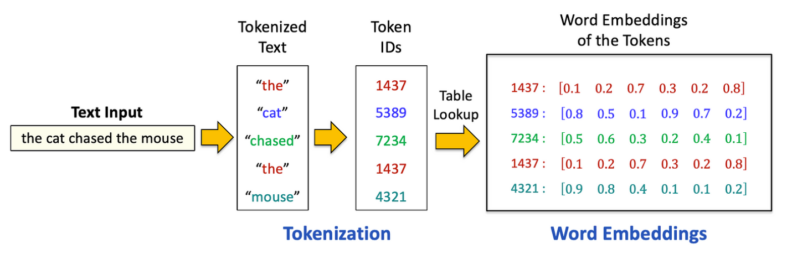
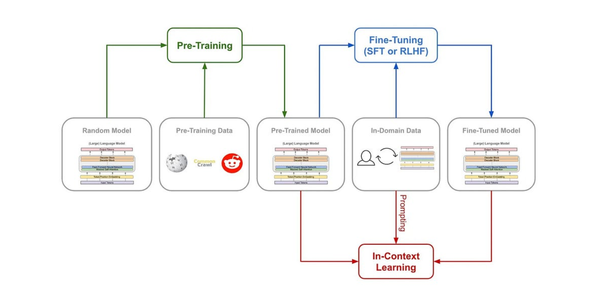

# Notes

## Tokenization and Vocabulary Design

Modern transformer models first convert text into discrete tokens according to a fixed vocabulary. Common subword tokenization schemes include **Byte-Pair Encoding (BPE)** (iteratively merging the most frequent symbol pairs into new tokens, used in GPT-2/3 with a byte-level variant); **WordPiece** (used in BERT, similar to BPE but adds tokens by likelihood); and **Unigram** (as in SentencePiece), which starts with a large candidate set of subwords and prunes by likelihood to a target size. These methods balance granularity: small vocabularies (e.g. characters) eliminate OOV but yield long sequences, while large vocabularies (including whole words/phrases) compress text into fewer tokens. In practice, vocabularies of ~10–100K tokens are used. For example, GPT-2/3 used ~50K BPE tokens, while GPT-4 adopted a ~100K-token Vocabulary (CL100K). Empirically, larger subword vocabularies often improve model quality: recent experiments show that monolingual LLMs with larger vocabularies achieve higher accuracy on language tasks.

### Vocabulary Size Trade-offs

**Larger vocabularies** reduce sequence length (more text per token) and often lower perplexity, but they increase model size due to bigger embedding and softmax layers—and may include many rarely used tokens. **Very small vocabularies** (e.g., character-level) eliminate OOV (out-of-vocabulary) issues but drastically increase sequence lengths, hurting long-range modeling. Subword tokenizers strike a balance by representing common words as single tokens and splitting rare ones into meaningful subwords.

### Cross-language and Efficiency Considerations

Multilingual models need larger vocabularies to cover multiple languages, but vocabulary size also affects context efficiency. For example, doubling the vocabulary (e.g., GPT-3 vs GPT-4) can nearly double the text that fits in a fixed context window. However, very large vocabularies (>200K) can cause significant memory and compute overhead. Typical vocab sizes (~30K–60K for monolingual models) aim to balance performance and efficiency.

### Key Insight

Subword tokenization (e.g., BPE, WordPiece, Unigram) is crucial for LLMs. Vocabulary size directly impacts model behavior—larger vocabularies can improve accuracy but at a computational cost; smaller ones offer better generalization and OOV handling by sharing representations across words.

## 2. Unsupervised Pretraining (Next-Token Prediction)

In pretraining, a transformer is trained autoregressively to predict each next token given its preceding context. Formally, the model receives input tokens x1,…,xt and produces logits over the vocabulary for the next token xt+1. The output of a causal LLM has shape (batch_size, seq_length, vocab_size), representing logits for each next-token prediction. Applying softmax yields a probability distribution over the vocabulary at each position. Training uses teacher forcing: at each position the true previous tokens are fed in, and the model's predicted distribution is compared to the true next token using cross-entropy loss. In practice one minimizes the sum of token-level cross-entropies (i.e. maximizes likelihood).

### Mechanics

The model uses causal masking to attend only to past tokens, predicting the next token at each position. It outputs logits for the next-token distribution, and cross-entropy loss is computed between predictions and actual tokens using shifted inputs (e.g., via CrossEntropyLoss in PyTorch).

### Objective

The goal is to minimize cross-entropy, or equivalently, maximize log-likelihood of the training text. This simple self-supervised task teaches the model syntax, semantics, knowledge, and reasoning—just by predicting the next token in large corpora.

### Pretraining Corpora

LLMs are trained on massive, diverse datasets—e.g., Common Crawl, WebText2, Books1/2, Wikipedia, and curated sets like The Pile (academic text, code, dialogue, etc.). Quality filtering (e.g., deduplication, cleaning) is crucial for reducing noise and improving generalization.

### Key Point

Pretraining uses an autoregressive next-token objective on large unlabeled corpora. The choice and quality of data critically shape the model's linguistic knowledge and reasoning abilities.

## 3. Supervised Fine-Tuning & Instruction Tuning

After pretraining, LLMs are often fine-tuned with supervised instruction data to improve task performance and follow human commands. In instruction tuning, models are trained on (instruction, response) pairs using cross-entropy loss—learning to map prompts (and optional context) to desired outputs.

### Popular Datasets

- **FLAN:** Benchmark NLP tasks reformatted as instructions
- **Alpaca:** ~52K GPT-3.5-generated Q&A pairs
- **Dolly:** 15K human-written prompts from Databricks
- **Others:** Meta's datasets, Self-Instruct (crowdsourced)

### Quality & Diversity Matter

Small, well-curated datasets (~1K) can rival large noisy ones. Effective datasets span varied tasks (QA, summarization, coding), use clean, balanced, and safe content, and include metadata (e.g., task type) to ensure coverage and reduce bias.

### Key Point

Instruction tuning makes LLMs follow human-like instructions using high-quality prompt-response pairs. Dataset clarity, diversity, and correctness often outweigh sheer size in impact.

## 4. Pre-training vs. Fine-tuning: Objectives and Scale

### Pre-training vs. Fine-tuning in LLMs

**Purpose:**
- **Pre-training** builds general language understanding by predicting next tokens on massive, unlabeled text corpora.
- **Fine-tuning** adapts the model to specific tasks or behaviors (e.g., mapping prompts to responses) using supervised or RL objectives.

**Examples:**
- GPT-3 was only pretrained (~500B tokens); no task-specific tuning.
- ChatGPT = GPT-3.5/4 fine-tuned on dialogue via instruction tuning + RLHF.
- Claude = Pretrained model fine-tuned to be "helpful, honest, harmless" using RLHF.

**Data Scale & Type:**
- **Pre-training:** Huge, diverse datasets (web, books, code).
- **Fine-tuning:** Smaller, focused datasets (e.g., 6.7K prompts in InstructGPT; 52K in Alpaca).

**Compute Cost:**
- Pre-training is compute-heavy (millions of GPU-hours).
- Fine-tuning is lighter—can be done with a few GPUs in less time.

In essence: Pre-training gives LLMs general knowledge; fine-tuning aligns them to tasks, formats, and human preferences.

## 5. Impact of Data on Model Behavior

The type of data used during training strongly influences an LLM's abilities, tone, and biases.

### Code vs. Text

Including code in pre-training boosts both coding and reasoning skills. Models trained on mixed code-text data outperform text-only ones—even on non-code tasks. In some cases, 100% code pre-training yielded the best reasoning results. This is why models like GPT-4 and PaLM use GitHub data: it enhances pattern recognition and logic.

### Dialogue & Instructions

Conversational and instruction-response data make models more interactive and polite. ChatGPT, fine-tuned on human dialogues, can follow up, admit errors, and mimic human tone—unlike its base version. Claude was aligned to be "helpful, honest, harmless" through similar fine-tuning. Without such data, outputs risk being unfiltered or unsafe.

### Long-Form & High-Quality Text

Books, articles, and academic texts improve handling of long-range context and factual accuracy. Datasets like The Pile, which combine literary, scientific, and code sources, help models generalize better. These models outperform those trained on noisy web scrapes in professional or academic tasks.

### Biases & Toxicity

Models reflect the biases in their training data. GPT-3, trained on web-scale text, can output stereotypes or hate speech. Overrepresentation of certain views can skew outputs. Mitigations like RLHF and filtering (used in ChatGPT and Claude) help reduce toxic or biased behavior.

### Key Insight

Training data defines a model's strengths and risks. Code enhances logic, dialogue data enables conversation, and high-quality sources improve coherence—while biased inputs require post-training alignment to ensure safe, reliable behavior.
