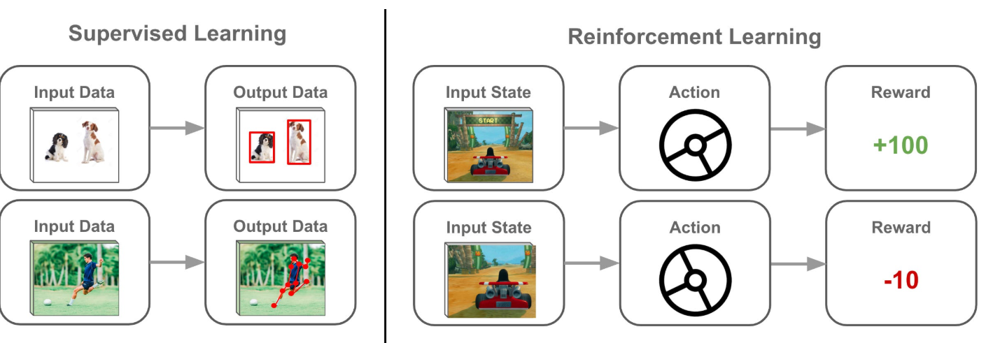

# Notes

## How LLMs Are Trained – Part 2: LLM Behavior and Architectural Insights

### Reinforcement Learning from Human Feedback (RLHF)

Modern large language models (LLMs) often use RL from human feedback to align outputs with human preferences. In RLHF, one starts with a pretrained base model and refines it using human judgments as a reward signal. The typical pipeline involves three stages:

1. **Pretrain a base LM.** A large decoder-only Transformer is first trained on massive text (cross-entropy objective). For example, OpenAI used a small GPT-3 model as the base for InstructGPT (the first widely-known RLHF model).

2. **Collect preference data & train a reward model.** The pretrained LM generates outputs for many prompts; human annotators then compare or rank these outputs by quality. A separate "reward model" (another neural net) is trained to predict these human preference scores from text. This reward model outputs a scalar score (reward) indicating how much a human would prefer a given response.

3. **Fine-tune with policy optimization (PPO).** The original LM is then fine-tuned with a reinforcement-learning algorithm (usually Proximal Policy Optimization) to maximize the reward model's score on its outputs. During this step, a KL-divergence penalty is imposed between the fine-tuned policy and the original pretrained LM to prevent it from drifting too far from fluent language. Without this KL term, the model can "game" the reward and produce incoherent or repetitive gibberish that the reward model mistakenly rates highly.

This RLHF process yields models that follow instructions and human values much better than a vanilla LM. For example, ChatGPT (based on GPT-3.5/GPT-4) uses RLHF so that the assistant is more helpful, truthful, and harmless to humans. In practice, most organizations freeze a large portion of the LM's parameters (or use low-rank adapters) during PPO fine-tuning for efficiency, but the core effect is to tilt the LM's distribution toward outputs humans prefer.

### The Role of Scale in Emergent Capabilities

LLM performance generally improves smoothly as we scale up model size (parameters), data size, and compute, following power-law "scaling laws". Kaplan et al. showed that on the standard next-token loss, increasing any of these factors yields predictable improvements, and larger models are much more sample-efficient (requiring fewer updates or data to reach a given loss). In other words, an 100× bigger model or dataset can reduce validation loss by a similar factor, following straight-line trends on log-log plots.

However, task-specific abilities often do not improve so smoothly. Many qualitative skills show **"emergent" behavior**: they are essentially absent in small models and then suddenly appear once scale crosses a threshold. For example, Wei et al. (2022) define an emergent ability as one "not present in smaller models but present in larger models; thus [it] cannot be predicted by extrapolating from small models". In practice, tasks like 3‑digit arithmetic, transliteration, or certain multilingual quizzes remain at random-chance performance for models up to ~10–20B parameters, then abruptly jump to high accuracy in larger models. The figure below (from Wei et al.) shows that GPT-3 (~13B) and LaMDA (~68B) transition from near-0% to high performance on a simple addition task once those scales are reached. Similarly, benchmarks like MMLU (multi-subject exams) and BIG-Bench tasks exhibit steep cliffs in capability after a critical scale.

These emergent effects mean that some abilities (e.g. multistep reasoning, common-sense Q&A, chain-of-thought) only become reliable in very large LMs. For instance, specialized prompting techniques like chain-of-thought are only effective past ~100B+ parameter models. In summary, scale is king: performance on average metrics rises predictably with size and data, but specific higher-level skills appear unpredictably once models reach sufficient scale.

### Behavioral Quirks and Training Effects

Despite their prowess, LLMs exhibit many quirks traceable to how they were trained. Some notable behaviors include:

**Hallucinations (confident fabrication):** LMs often produce plausible-sounding but false or misleading information. This arises because the model's goal is to maximize the likelihood of fluent text, not factual accuracy. In fact, recent analysis shows that even an ideal next-token predictor will inevitably hallucinate at a rate roughly equal to the fraction of facts seen only once in training. One intuitive explanation is that LMs generate one token at a time: they can form "plausible" sequences that in truth have no correct completion. Thus a model might confidently invent details to maximize local fluency. Mitigations (RLHF, retrieval or grounding, calibration techniques) are an active research area.

**Biases and unfairness:** LLM outputs reflect biases present in the training corpus. As Guo et al. note, these models "have inherent biases that reflect societal prejudices present in their training data". Common examples include stereotyping language about gender, race or politics. These biases arise automatically because the LM captures statistical patterns from Internet text, many of which encode historical or cultural prejudice. Without specific fine-tuning or filters, the LM may repeat these biases.

**Overconfidence and calibration issues:** After training (especially after alignment), LMs can become poorly calibrated – i.e. their confidence scores (probabilities) no longer match actual accuracy. In practice, an LLM might assign very high confidence to an answer even when it is wrong. This overconfidence is partly a side-effect of optimizing for human-preference or task-specific rewards. (Interestingly, reducing hallucinations via alignment can reduce calibration, creating a tradeoff.)

**Repetition and output loops:** Without careful decoding, LMs can get stuck repeating phrases ("I'm sorry, I'm sorry…") or looping. This is partly a decoding artifact (e.g. greedy sampling) and partly because the model has learned that repeating safe or common tokens yields high likelihood under its training distribution. Techniques like temperature scaling or nucleus sampling are used to mitigate this.

**Reluctance or refusal to answer:** Models fine-tuned with RLHF often learn to refuse disallowed or harmful prompts ("I cannot assist with that request"). This safety behavior is directly due to RLHF: during alignment, outputs violating the human-provided policy were scored low, so the model learned that the best "safe" answer is to say "no" or issue a caution.

**Prompt sensitivity:** LLMs can be very sensitive to how a question is phrased. Small changes in wording or adding irrelevant context can lead to wildly different answers. This occurs because the model attends to patterns in the prompt and tries to match its training data. In practice, even punctuation or example formats (few-shot prompts) can drastically change output quality – another consequence of pattern-based training.

These quirks all stem from the training regime and objective. For example, because standard pretraining optimizes next-token accuracy on web text, the model learns to continue any conversation with the most likely wording, whether or not that text is true or logical. As the hallucination analysis shows, simply maximizing predictive accuracy forces some hallucination. Similarly, the lack of an "I don't know" token in the objective means the model rarely abstains – it will hallucinate an answer rather than say "no data". Biases arise because the model's loss function never penalizes reproducing prejudiced associations from data.

In short, what LLMs do is exactly what their training rewards. They become arbitrarily good at generating fluent continuations of text like in their corpora, but have no intrinsic grasp of truth or intent beyond that. Modern alignment techniques (instruction tuning, RLHF, safety fine-tuning) shape these behaviors, but they cannot fundamentally change the fact that LMs are statistical predictors. Understanding an LLM's quirks therefore means understanding its data and objectives.

### Thought/Chain-of-Thought Reasoning and "Thinking" Models

Chain-of-thought prompting guides LLMs to solve problems step-by-step, leading to higher accuracy on complex tasks. Instead of jumping to an answer, the model "thinks aloud," mirroring how humans reason through problems.

Advanced models like DeepMind's DeepSeek take this further by reasoning in multiple languages and using internal dialogues to reach better answers—often outperforming traditional supervised learning. A famous example is AlphaGo's unexpected "Move 37," which demonstrated that AI can reason in ways that seem unconventional but are highly effective.

These "thinking models" excel in complex tasks like debugging or multistep reasoning, but they're not always optimal for simple factual queries or minor corrections, where faster, direct answers are more efficient.

### Handling Hallucinations and Use of Tools

To improve reliability, modern LLM systems now integrate external tools like code interpreters or web search APIs. This helps reduce hallucinations and boosts answer correctness.

For instance, ChatGPT may use a Python tool or browse the web during a session to verify answers or perform computations. This hybrid approach—combining symbolic tools with learned models—is known as neurosymbolic AI or agent-based systems.

However, when these tools are disabled, the model relies solely on its internal reasoning, which may reduce accuracy on certain tasks.

### Architecture and Scale Effects

All the above applies to Transformer-based decoder models (e.g. GPT variants). The transformer architecture – with multi-head self-attention and feed-forward layers – lets LLMs consider long contexts in parallel, but it also imposes limits. For example, LLMs have a fixed context window: they cannot natively remember anything beyond the last N tokens. This limitation causes them to lose track of very long conversations or documents. Likewise, because attention is global and each layer is the same everywhere, the model has no built-in modular "memory" or "logic" – any reasoning ability must be encoded implicitly in its weights.

Crucially, empirical studies show that scale dominates architecture details. Kaplan et al. observed that, aside from scale (params/data), most "other architectural details (e.g. network width vs. depth) have minimal effects" on performance. In practice, simply making a model wider or deeper matters far less than making it bigger overall. That said, large depth and width do enable richer representations, which in turn allow emergent skills (like abstractive reasoning or code generation) to appear.

In summary, LLM behaviors are a joint product of how they were trained and how big they are. The Transformer architecture provides the machinery (attention, positional encoding) but the observable quirks (hallucination, bias, emergent reasoning) arise from the interplay of that architecture with scale and the training objectives. By studying these factors, practitioners can better predict and control LLM behavior in their applications.
